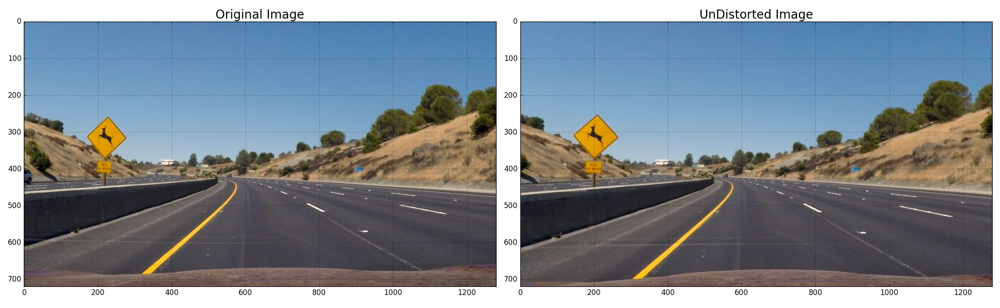

##**Advanced Lane Finding Project**

The goals / steps of this project are the following:

* Compute the camera calibration matrix and distortion coefficients given a set of chessboard images.
* Apply a distortion correction to raw images.
* Use color transforms, gradients, etc., to create a thresholded binary image.
* Apply a perspective transform to rectify binary image ("birds-eye view").
* Detect lane pixels and fit to find the lane boundary.
* Determine the curvature of the lane and vehicle position with respect to center.
* Warp the detected lane boundaries back onto the original image.
* Output visual display of the lane boundaries and numerical estimation of lane curvature and vehicle position.

## **[Rubric](https://review.udacity.com/#!/rubrics/571/view) Points**
---
###**Writeup / README**

The write up for Project-4 Advanced Lane Finding is written in [`README.md`](README.md) file provided in the root folder of the project directory.  It describes the necessary details along with image & video artifacts that are required for evaluation as per the rubric points mentioned.

I have written the entire program required for this project in [`p4.py`](p4.py) file.  It is a plain python file which can be executed directly.  It requires `moviepy` library to process video files. Also, it expects the original folders structure that were provided as project kit to read/write image and video files.


###**Camera Calibration**

####1. Briefly state how you computed the camera matrix and distortion coefficients. Provide an example of a distortion corrected calibration image.

Camera calibration is a process where the distortions of the images generated by a particular camera can be evaluated to arrive at the variance between the image and the reality, then derive a set of co-efficient that can be used to apply on the images generated by that camera to remove the distortion effects.  In this process, we need a set a sample images containing corners that can be easily identified & measured.  We were provided with a set of chess board images containing corners for camera calibration.  The sample images are taken at various angles & zoom level that contains a good mix of different distortions.   The chess board images contains 9 corners in the horizontal direction (x-axis) and 6 corners in the vertical direction (y-axis).  

As a first step, identify the number of corners in the image, here we know that were provided with images containing 9x6 corners and the same can be very well verified by looking at the images.  For calibration purpose, we are assuming that the third dimension/plane is 0 (z=0) and making all calculations with x and y coordinates.  Identify the x, y coordinates of corners in the image as well as in real world, called 'image points' and 'object points' respectively.  Calculating the image points using OpenCV's `cv2.findChessboardCorners()` function and whenever we could find corners, they are added to an array.  We are assuming that the object points are the same for each calibration image and appending it to another array whenever corners were identified using the cv2 find chess board corners function.

Once we have the image points and objects points, use those data to arrive at camera matrix and distortion coefficients using `cv2.calibrateCamera()` function.  Using this matrix and coefficients, we can un-distort any images taken using the same camera used to take sample images.  The camera matrix and distortion coefficients calculation is an one time job and those are safely stored in a pickle file to re-use it whenever needed.  

In my program `p4.py`, there is a function called **`calibrateCameraBySamples()`** to do this camera calibration and find out the camera matrix and distortion co-efficients.  It takes a folder name and file pattern to read in all the images to be used for calibration.  Also, it takes the number of corners exists in these images in x and y axis.  Then finally takes a pickle file name and a flag, whether to save it in a pickle file or not. When you run this for the first time, it creates the camera matrix (`mtx`) and distortion coefficients (`dist`) and stores it in pickle file named `'`**`cam_calib_mtx_dist.p`**`'` in the same folder that contains the sample calibration images. From the subsequent execution, if there is a pickle file available, it reads the coefficients from the pickle instead of calculating it using sample images.  I have written one more function called **`testUndistor()`** to test the camera calibration by un-distoring the sample images.  Refer the `line # 27 to 95` in the `p4.py` file.  I have shown couple of samples of distorted & undistorted images that were generated using the above mentioned methods.

Calibrated Road Image - Refer the Deer Crossing Traffic Sign, in the distorted image it appears in an angle, whereas in the un-distorted image, it appears as if it is seen from straight angle



###**Pipeline (single images)**

####1. Provide an example of a distortion-corrected image.
The first step in the pipeline is to un-distort the given image (or frame or a video stream).  Using the camera calibration function that is explained in the above section, the camera matrix and camera distortion is used in the pipeline to un-distort the image.  Since this is part of creating binary threshold image, the code for this is present in the **`getBinaryImage()`** function.  The second line of that function calls the **`cv2.undistort()`** function with the mtx and dist objects passed to it.  The sample image that was taken in the process is shown below.


####2. Describe how (and identify where in your code) you used color transforms, gradients or other methods to create a thresholded binary image.  Provide an example of a binary image result.
In my image/video processing pipeline, creating a thresholded binary image from the un-distorted image is the first step towards identifying the lane lines in the road images.  The driver's view of road image would consists of road, lane lines, traffic signs, other vehicles, sky and surrounding environment as background.  From this view, using various OpenCV library functions, remove the unnecessary items from the image to clearly locate & highlight the lanes lines which is required for further calculation.

In my code `p4.py`, I have created a function called **`getBinaryImage()`** which takes a color image as input and gives out the thresholded binary output image.  This function is called in the main **`pipeline()`** function to get the binary image. Following are the steps followed to arrive at the binary image.

 1. Undistort image
 2. Convert the image from RGB to HSV color space
 3. Pickup the Yellow colored pixels from the HSV image with a threshold
 4. Similarly, pickup the White colored pixels from the HSV image with a threshold
 5. Convert the image from RGB to HLS color space
 6. Pickup the White colored pixels from the HLS image with a suitable threshold
 7. Pickup the White colored pixels from the original image as well with the suitable threshold
 8. Combine all 4 colored binaries with an bitwise or condition
 9. Finally, Perspective Transform with the src and dst coordinates and arrive at the warped image

An example thresholded image is shown below.  (Note: This image is taken by skipping the Step-2: Perspective Transformation)


####3. Describe how (and identify where in your code) you performed a perspective transform and provide an example of a transformed image.

As explained in the previous question, my function **`getBinaryImage()`** which is called in the pipeline() function creates a perspective transformed (warped) image while creating the thresholded binary image.  In order to create the warped image, the source and destination points is created as a hardcoded coordinates by analysing the images.  The src and dst points are provided by a function named **`getTransformationPoints()`**, you can view this function to know the coordinates chosen.  Using these points, another function named **`getTransformationMatrices()`** is called to get the Transformation & Inverse Transformation Matrix, (M and Minv respectively).  With these transformation matrix, **`cv2.warpPerspective()`** function is called to perform the perspective transformation of the image/frame.


During the program development, I verified that my perspective transform was working as expected by drawing the `src` and `dst` points onto a test image and its warped counterpart to verify that the lines appear parallel in the warped image.


####4. Describe how (and identify where in your code) you identified lane-line pixels and fit their positions with a polynomial?

Finding lanes from the warped thresholded binary image can be done in several ways.  I followed two approaches in my code to detect lanes as taught in the lesson. The first approach is to find the lanes using Histogram.  When you look at the warped thresholded binary image, it will have two parallel lines (indicating the lanes) appearing very clearly with out much noise.  When we sum the pixels along the y-axis, we will get a (horizontal) list where the positions of lines having an exceptionally high sum.  When we lay that list into a Histogram, it clearly pinpoints the location two lanes in the x-axis.  In this way, we can find out the lane position with in a finite range of 100 pixels.  Once we have the starting lane line pixel positions range, the accuracy can be improved by searching the exact pixel position with in that window. And this can be done on small horizontal strips of an image iteratively starting from bottom of the image. So that we can precisely find the lines on the image at the end of this iterative process.  This method even identifies the lane line pixels position when the lanes are curves. In `p4.py` file, a function by name `findXY_Histogram()` performs the operation described and identifies the lane line pixels.  This function takes a warped binary image as an input, uses bottom half of the image to arrive at a Histogram and divides the images to 9 strips to progressively identify the pixel positions.

A sample warped binary thresholded image and its Histogram is shown below.


The second approach is to find lane line pixels using the previous frame's lane line pixel position.  This method doesn't create Histogram to find out the original base position, rather it uses the previous frame's lane line position which would probably within a reasonable range in many of the road videos, except when there are sharp curves.  In my code `p4.py`. there is a function called `findXY_NonHistogram()` which takes warped binary image and the previous frame's fitted line positions as inputs and finds out the lane line pixels in the new frame with in that range.

As suggested in the lesson, I used a `Line()` class to store the previous frame's coordinates and used a function called `lineCheck()` to determine whether the lane line pixels detected are reasonably accurate.  In my `pipeline()` function, I used the following block of code to decide on which aproach to use for lane line pixels detection.  If the previous frame's lane line pixels were detected using Histogram method and they appears good, then I use the non-histogram method for the current frame. Otherwise I use the Histogram method itself again.  I noticed that when the lanes are straight & reasonably non-broken, the usage of histogram method is less.  Otherwise, if the road was curved or lines are broken and not clear, it uses the histogram approach at those situations.

```
if (left_line.detected == False) or (right_line.detected == False):
    #find by histogram method
    leftx, lefty, rightx, righty = findXY_Histogram(binary_warped)
    cnt_h += 1
else:
    #find by non-histogram method
    leftx, lefty, rightx, righty = findXY_NonHistogram(binary_warped, left_line.current_fit, right_line.current_fit)
    cnt_nh += 1
```

Here is an example of an inprogress image showing the detected lines from the warped binary image.


####5. Describe how (and identify where in your code) you calculated the radius of curvature of the lane and the position of the vehicle with respect to center.

In my code `p4.py`, I have a function named `calculateRadiusOfCurvature()` to calculate the radius of curvature and a function named `calculateVehiclePosition()` to calculate the vehicle position.  The `calculateRadiusOfCurvature()` function is called in the `pipeline()` function itself as the radius of curvature is required to verify the correctness of the identified lane lines using `lineCheck()` function.  The `calculateVehiclePosition()` function is called in `drawPolygonAndUnwrap()` function, which is at the last step of the processing pipeline, i.e. the vehicle position is calculated just before writing them in the image/frame.

####6. Provide an example image of your result plotted back down onto the road such that the lane area is identified clearly.

In the `p4.py` file, the `pipeline()` function is the important function that invokes almost all required sub-functions.  The `processImages()` is another highlevel function that reads all test images, process them by calling the `pipeline()` function and writes the output images in the `output_images` folder.  I have shown a sample output image of a test sample.  Please refer [output_images folder][f1053d9e] for the output of all test images.

[f1053d9e]: /output_images "output_images folder"


---

###Pipeline (video)

####1. Provide a link to your final video output.  Your pipeline should perform reasonably well on the entire project video (wobbly lines are ok but no catastrophic failures that would cause the car to drive off the road!).
I used the same `pipeline()` function in `p4.py` program file to process the video files as well.  
Here's a [**link to my video result**](./out_project_video.mp4)

---

###Discussion

####1. Briefly discuss any problems / issues you faced in your implementation of this project.  Where will your pipeline likely fail?  What could you do to make it more robust?

My overall approach to find out the lane lines for the image/video is given below:

1. Create a warped thresholded binary image of the input frame.
2. Find out the lane line pixels either using Histogram technique or using the previous lane line pixel position.
3. With the identified pixel positions, find the best fitting line using `np.polyfit()` method & 2nd degree polynomial. Refer `pixelPositionToXYValues()` function
4. Calculate Radius of Curvature for both side lines
5. Verify the identified lane line positions using radius of curvature of current and previous frame's pixel positions.
6. Draw the polygon using the warped binary image, then retransform back the perspective transformed image to the normal perspective.
7. Merge the image received in the previous step with the original un-distored image and display to the user.

####Challenges Faced:

- Arriving at an appropriate src and dst points.  I am using hardcoded src and dst points that I arrived after carefully viewing the test images.  Though it is very good to arrive at a dynamic coordinates using the image size reference, I used the hard coded values to avoid any confusion.  Often I ran in to zero-value error matrix exception at the middle of a video processing when the src & dst are not very appropriate.

- Arriving at the binary thresholded image was quite interesting.  I was using the  `getBinaryImage1()` function to arrive the thresholded image, which gave a pretty reasonable result in the project video except at 3 frames.  Based on the suggestion provided, changed the logic to use color selection in HSV, HLS and normal image and combine them to identify the lanes even in a better manner.  The updated code is available in `getBinaryImage()` function.  It gives the perfect output video with out any error in the polygon drawn in the lanes.

- Understanding the concepts and calculations behind identifying the pixel positions of the lane.  With the help of articles from Prof.Vivek Yadav, Hearty Paul and google searches, able to figure out what is happening and could do a program.  However, I still couldn't understand using the convulution for sliding window method, so I have ignored it for now, will be exploring in the upcoming weeks.

- The verification of the detected lanes was quite a challenging, I was closely tracking on which method (histogram or non-histogram) is getting chosen dynamically by the algorithm for the given video by tracking almost all the parameters involved.  I was properly using the previous frame's pixel position coordinates if the detected lane line pixels were falling beyond the certain limit.

- I got a wierd problem in my code.  The `out_img` variable containing an image object that got created by stacking three layers of thresholded binary image is not getting rendered properly with `plt.imshow` or any other image viewing library.  I asked in the forum as well as worked with my mentor on it, but couldn't figure it out.  Analysing that array showed that it has non-zero values in it as it is supposed to be.  But it is just showing a black screen.  Even when I tried to paint different colors for the left and right lane pixels, it is not showing up.  Luckily it was not affecting any calculations or not falling part of the processing pipeline, hence left that for now. Otherwise I could have provided a better image (second one) for Question# 4.

- In order to remain structured with the code, I tried creating classes to store settings variables.  Those are the `CameraCalibration()` and `Parameters()` classes.
