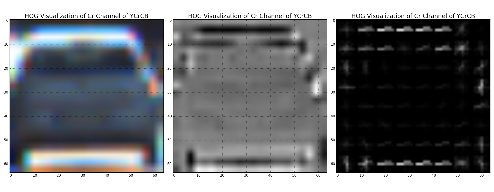
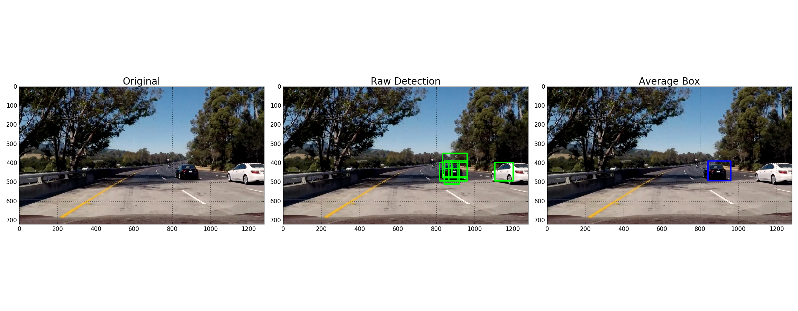

##**Vehicle Detection Project**
---
The goals / steps of this project are the following:

* Perform a Histogram of Oriented Gradients (HOG) feature extraction on a labeled training set of images and train a classifier Linear SVM classifier
* Optionally, you can also apply a color transform and append binned color features, as well as histograms of color, to your HOG feature vector.
* Note: for those first two steps don't forget to normalize your features and randomize a selection for training and testing.
* Implement a sliding-window technique and use your trained classifier to search for vehicles in images.
* Run your pipeline on a video stream (start with the test_video.mp4 and later implement on full project_video.mp4) and create a heat map of recurring detections frame by frame to reject outliers and follow detected vehicles.
* Estimate a bounding box for vehicles detected.

## [Rubric](https://review.udacity.com/#!/rubrics/513/view) Points
###Here I will consider the rubric points individually and describe how I addressed each point in my implementation.  

---
###Writeup / README

####1. Provide a Writeup / README that includes all the rubric points and how you addressed each one.  You can submit your writeup as markdown or pdf.  [Here](https://github.com/udacity/CarND-Vehicle-Detection/blob/master/writeup_template.md) is a template writeup for this project you can use as a guide and a starting point.  

P5-Vehicle Detection project writeup is given in the file [writeup_p5.md](writeup_p5.md) file. The code for this project is in [p51.py](p51.py) file.

###Histogram of Oriented Gradients (HOG)

####1. Explain how (and identify where in your code) you extracted HOG features from the training images.

In my program file p51.py, there is a function by name `get_hog_features` which takes an image and other parameters as input and gives out HOG features as an output for the given image. The key input parameters for this method are:
- image: a single image containing 3 channels
- orient: number of bins to split the orientations
- pixels_per_cell: number of pixels to be used in each side of a 2D cell
- cells_per_block: number of cells to be used in each side of of a 2D block
- visualise: a flag to get an HOG Image as an additional output
- feature_vector: a flag to convert the HOG features in to 1D list

In order to train a classifier using training data, first I had to read all the test data.  The function `loadTrainingImages` loads all names of the training image file names in a list and send it to the function `extract_features`. This function reads each file name and loads the image data using `mpimg.imread`.  This image is passed to the `get_hog_features` function that described above.  And the output hog features are collected back in to another array, and used to train the `LinearSVC` classifier instance.  

In order to effectively extract the HOG features from a given image, it is important to choose the right parameters for orientations bin count, pixels per cell, cells per block.  And also we need to choose the right color space and image channels of input image to use for HOG feature generation.  In the below sample images of HOG features (which are randomly chosen from the training image set), I have shown HOG features using different color space and channels.

HOG Feature of Car samples:

HOG Feature of Not Car samples:

####2. Explain how you settled on your final choice of HOG parameters.
In the earlier projects and exercises, we detected the objects in an image using various gradients that could be extracted from the given image.  However, those mechanism are very unique to the aspects of that color & shape, they cannot handle any variations in that image color or shpae or structure.  Applying a gradient on an image or its components or color binaries would gives us the ability to handle any variations in the color & shape of a similar image.  Thereby it makes HOG features a robust mechanism for object detection from images.  

The quality of the training and prediction directly varies with the details of HOG features.  It can be tweaked with the following parameters to get an effective HOG feature.

1. Color Space: Generally HOG features are extracted in a single channel of an image.  So, using the appropriate color channel will help in getting the essential features to be used for HOG feature generated.  In our project, I tried various color spaces and finally settled with YCrCb, which helps in effectively seperating the luminence and color difference that helps in seggregating features effectively.

1. Number of Channels to use in an image: HOG features can be arrived at an individual color channel of the image or it can be arrived at all channels and combine them to a single HOG feature for the given image. Often times, using single channel to use for HOG feature generation would be faster to process, but many essential features may not be sufficient.  Hence I used all the channels in the chosen color space of the image.

1. Number of Orientations bin: Histogram is generated by binning the value to some buckets. In HOG, the binning happens based on orientation gradients.  We can bin the orientation from 6 to 12 buckets.  Having very less bins (ex: 6) will lead to broad binning and thereby losing some essential features. On the other hand, having too many bins (ex: 12) will lead to too much detail used and will not help in generalizing the feature.  And also takes long time for processing.  To have an effective bin size, I chose the orientation bin size as 9.

1. Pixels per Cell: When we try to arrive at a Histogram, the entire image is split into a bunch of smaller number of cells of size (rows x cols) pixels. Having too many pixels in one cell will  lead to less number of cells and thereby more generalization happens.  Similarly having too less pixels in a cell will lead to too specific & would lead to over fitting.  So, I chose an average of 8 pixels per cell on both rows and columns. For the given 64x64 pixel image, there was 8 cells on each direction.

1. Cells per Block: In the HOG process, it strides the cells to arrive at average of data over a block of cells.  This block will have rows x cols of cells.  If we have too many cells per block, then the generation will be more leading to loss of essential features.  So, I used 2x2 cells block for effective HOG features.

In my code `p51.py` file, the HOG features are extracted in the function `get_hog_features`. This function is used in the function `single_img_features` to extract the HOG as part of processing. The below samples shows the HOG features images taken at different parameters:

orient = 6, pix_per_cell = 16, cell_per_block = 4, hog_channel = 'ALL'

orient = 9, pix_per_cell = 8, cell_per_block = 2, hog_channel = 2

orient = 12, pix_per_cell = 4, cell_per_block = 1, hog_channel = 1

####3. Describe how (and identify where in your code) you trained a classifier using your selected HOG features (and color features if you used them).

In my code `p51.py` file, there is a function by name `getTrainedModel`, this function gives the trained classifier to use it for prediction.  This function reads the classifier either from a pickle file if there already exists one, else trains a fresh LinearSVC model and gives out a trained model.

The function `prepareTrainingAndTestData` reads the training image data, extract features and does pre-processing of the data and feeds to a classifier to train it.  In the `extract_features` function, the actual feature extraction happens for all images iteratively. I am using spatial features, color histograms, HOG features of images in the order to train the model.

The function `getTrainedModel` does everything and returns a trainer model and a scaler to use it with for predictions.

###Sliding Window Search

####1. Describe how (and identify where in your code) you implemented a sliding window search.  How did you decide what scales to search and how much to overlap windows?

In my code `p51.py`, there are two functions by name `slide_window` and `search_windows`.  

The first function `slide_window` takes an image, windows size and window overlap percentage as input parameters and comes up with the list of windows to search in each image. In our lesson, it was shown to do it perform it for all frames of a video, but it is not truly necessary.  It takes an image as an input just to use its size value.  So, I made it funtion to be called only once for a given vide and  use the same list of windows for all the subsequent image frames to search.

The second function `search_windows` is the core function that takes an image to find the presence of cars.  It takes the classifier as an input and uses it to predict the presence of car in a sub-window.  It also takes a list of windows to do an iterative search for each sub-window.  

For any given scenarios, there is absolutely no need to search through the entire image to look for cars. Because, the vehicles are going to be driven only on the road, so I chose to search only in the bottom half of the image, to be more precise, I am searching in the range of 350 to 700 pixel range in the y-axis.  Moreover, the vehicles are going to be in different size depending on the proximity of the other vehicles, so I further split the region in to 3 and decided on the following size of the windows and overlap region to effectively arrive at the list of windows to search.

Region|Window Size|Overlap
--|---|--
[350, 650]|(80, 80)|(0.50, 0.50)  
[350, 650]|(96, 96)|(0.50, 0.50)  
[350, 700]|(128, 128)|(0.50, 0.50)  

The above windows sizes and overlaps are arrived at trying various options and optimized to arrive a model where it detects the cars with a reasonable time and with very less false positives.  In the `process_image` function, the `search_windows` function is called to search the windows and find out the hot windows. A sample image is arrived to show the slide window in a picture to show the search region and segments.

####2. Show some examples of test images to demonstrate how your pipeline is working.  What did you do to optimize the performance of your classifier?

In my code `p51.py`, the function `process_images` takes a folder/file name patter as an input and processes those images using a function `process_image` and arrives at the output.  As explained above, I used the Spatial feature, Color histograms and HOG features of the given image to train and detect the cars in the sample images.  I trained the model using the training data provided as part of project kit.  And it ultimately gave a very good output on the test images.  In order to futher optimize, I applied the threshold on the identified hot boxes to remove any false positives. And combine the hot boxes to find out the min and max ranges and arrive at the bounding boxes.  The output of the test images are shown below.

---

### Video Implementation

####1. Provide a link to your final video output.  Your pipeline should perform reasonably well on the entire project video (somewhat wobbly or unstable bounding boxes are ok as long as you are identifying the vehicles most of the time with minimal false positives.)
As described in the above questions, my program `p51.py` is used to test the output on the sample videos provided.  It did reasonably well with few false positives. In order to optimize the detections, I applied threshold to remove any false positives.  And also I used the detections of previous frames (up to 10 or 15) to average it with the current window detection for a reasonble performance with the given trained model.  Here's a [link to my video result](./out_p4_project_video.mp4) that was ran on the Project-4 output video.

####2. Describe how (and identify where in your code) you implemented some kind of filter for false positives and some method for combining overlapping bounding boxes.

In the `process_image` function, the window positions containing all positives are captured in the `hot_windows` variables. It would contain false positives as well.  In order to remove the false positives, I am thresholding them to eliminate any detections that are less than 2. The function `apply_threshold` does the thresolding on the heatmap image of the detections.

Another optimization performed is to smoothen the detection of cars in a sequence of frames.  The function `smooth_hotboxes` does this action.  It stores the car position detections of previous 15 frames.  It adds the current detection to that hot windows and `scipy.ndimage.measurements.label()` function is applied on that combined hot windows to arrive a smooth detected car positions in a given video.

Here are few example of heat image showing the thresholding function:

Here is a sample image showing the detections after applying the `scipy.ndimage.measurements.label()` function.

---

###Discussion

####1. Briefly discuss any problems / issues you faced in your implementation of this project.  Where will your pipeline likely fail?  What could you do to make it more robust?

It is a nice project that gives us a good start on detecting vehicles in the road along side the autonomous vehicle.  The approach that I took is to use a trained LinearSVC classifier to detect vehicles.  The model was trained with a reasonble size of training data (~8900 cars and not cars each).  In order to train the model, I used the spatial features, color histogram and HOG features of the given training images.  The test accuracy of the trained model came to 99.27% which is a very good accuracy in this case.  Then I used the sliding window techniques to arrive at the list of windows to be searched for cars, and with that list, I searched for the vehicles in each frame using the trained classifier.  Once there is some detection, they are thresholded to remove false positives, then smoothened and arrived at the final rectangle sizes of the detected vehicles.  The above images and video shows the output.

Challenges:
1. The training of the model was quite challenging in my laptop having intel core i7 processor.  It was giving memory error when I try to use the complete set of images.  Managed to prevent the memory error by closing all other applications and running the program alone.
2. The prediction on the videos was very time consuming, after all tweaking, the final output video took nearly 35 minutes to generate a 51 second video (containing 1261 frames).  Each frame was taking around 1.6 seconds to process.  Initially, it was taking nearly 5.5 seconds for each frame, after several optimization and removal of unnecessary slide_windows function execution, it came down drastically to 1.6 seconds average.
3. The above two challenges can be eliminated by using GPU based computers/servers to a significant extent.
4. Tweaking the parameters for the feature extraction was quite challenging, multiple iterations of trial and error was needed with some logic behind each change to arrive at the final settings.  However there are still lot of opportunities to improve.
5. For detecting just cars alone is this challenging, then detecting pedestrians and other objects are going to be even more challenging.  And the worst part is to find the training data set for those other objects.  It is better to use a Deep Learning Neural Network instead of a Machine Learning classifier.  Even better option is to use any pre-trained models like LeNet or GoogLeNet CNN could be used to detect any objects that comes around the autonomous vehicle.  I plan to continue work on this further and try with some pre-trained CNN model to predit.
---
